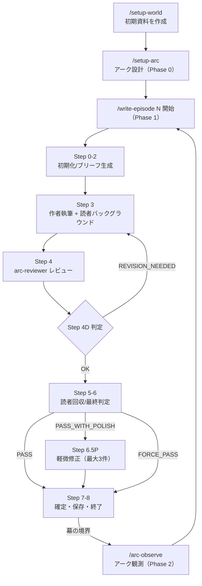

# Agentic Writing 仕様書（SPEC）

## 1. 主目的

### 1.1 主目的
`/setup-world`・`/setup-arc`・`/edit-story`・`/write-episode`・`/arc-observe` の5コマンドを通じて、Web小説制作の初期設定、アーク設計、継続的な設定更新、エピソード執筆と品質管理、アーク観測を再現可能な手順として提供する。

### 1.2 成功条件
- 作品資料（`story/`）が整合性を維持して生成・更新される。
- エピソード本文（`episodes/`）がアークレビューと読者評価を経て確定される。
- 執筆中断時に `workspace/progress.md` から再開できる。
- 品質記録（`story/quality-log.md`）と運用履歴（`archive/`）が残る。
- アーク設計（`story/scenario-arc.md`・`story/character-arcs.md`）が執筆全体を統括し、幕の境界で `/arc-observe` により設計と実際の乖離が修正される。

## 2. 概要

### 2.1 システム概要
Agentic Writing は、複数エージェントの役割分担により小説執筆を進行するオーケストレーション仕様である。

| エージェント | 役割 | モデル | 起動タイミング |
|------------|------|-------|-------------|
| `author`（作者） | 本文執筆・改稿 | Opus | Phase 1 毎話 |
| `arc-reviewer`（アークレビュアー） | 役割タグ準拠評価・台詞スタイル検査・改稿判定 | Sonnet | Phase 1 毎話 |
| `reader-*`（読者 × N） | ペルソナ別感想・評価 | Sonnet | Phase 1 毎話（bg） |
| `arc-observer`（アークオブザーバー） | 全エピソード通読・乖離検出・設計修正 | — | Phase 2（幕の境界） |

> **編集エージェント（editor）は廃止済み**。エピソードブリーフ生成はオーケストレーターが直接担当する。

### 2.2 フェーズ構成

| フェーズ | コマンド | 頻度 |
|---------|---------|-----|
| Phase 0 | `/setup-arc` | 巻に一度（執筆前に必須） |
| Phase 1 | `/write-episode N` | 話ごと |
| Phase 2 | `/arc-observe` | 幕の境界ごと |

### 2.3 ドキュメント責務
- `SPEC.md`: 目的、契約、成果物、判定基準などの正規仕様
- `docs/workflows.md`: 手順詳細、分岐、レジューム、Mermaid 詳細図

## 3. スコープ

### 3.1 対象
- `/setup-world`: 2モード対応（新規作成: 7ステップ / 既存作品インポート: Steps I-0〜I-7 + Phase 2 アーク設計）
- `/setup-arc`: アーク設計（感情命題・三幕構成・役割マップ・キャラクターアーク）。`/write-episode` の前に必須
- `/edit-story <自然言語指示>`: 既存資料の更新と波及影響管理
- `/write-episode <話数> [--max-revisions=N]`: 執筆、評価、改稿ループ、確定保存
- `/arc-observe`: 幕の境界でのアーク観測（設計と実際の乖離検出・修正）

### 3.2 スコープ外
- モデル課金や実行基盤運用
- 外部公開プラットフォーム連携
- UI 実装

## 4. 公開インターフェース

### 4.1 コマンド I/F
| コマンド | 入力 | 出力 |
| --- | --- | --- |
| `/setup-world` | 対話回答（モード選択・ジャンル・設定・文体等） | `story/*.md`（初期資料）。インポートモードは `scenario-arc.md`・`character-arcs.md` まで一気通貫生成 |
| `/setup-arc` | 対話回答（テーマ・アーク設計） | `story/scenario-arc.md`, `story/character-arcs.md`, `story/arc-design-progress.md` |
| `/edit-story` | 自然言語変更指示 | 対象 `story/*.md` の更新 |
| `/write-episode` | 話数、任意で `--max-revisions` | `episodes/*.txt` + `story/` 更新 + `archive/` 保存 |
| `/arc-observe` | （なし） | `workspace/arc-observation-report.md` → `archive/arc-observe-vol{N}-act{N}/` + 必要に応じ `story/scenario-arc.md`・`story/character-arcs.md`・`story/handover-notes.md` 更新 |

### 4.2 判定 I/F

- arc-reviewer 判定（`workspace/arc-review.md`）
  `OK | REVISION_NEEDED | MAJOR_REVISION`
- リーダー最終判定（Step 6）
  `PASS | PASS_WITH_POLISH | FORCE_PASS`

### 4.3 進捗 I/F
`workspace/progress.md` を実行状態の唯一の復帰点として扱う。最低限次を保持する。
- `episode`
- `max_revisions`
- `revision_count`
- `current_step`
- `step_status`

## 5. 全体の処理の流れ

### 5.1 初期構築フロー（`/setup-world`）

**新規作成モード（Steps 1〜7）:**
1. カテゴリ・ジャンル選択
2. テーマ・コンセプト確定
3. 世界観設定
4. キャラクター定義
5. プロット骨格定義
6. 文体ガイド・AI癖制御定義（構成パターン推奨相性表・感覚レンズを含む）
7. 読者ペルソナ定義
8. `story/` への一括出力

**既存作品インポートモード（Steps I-0〜I-7 + Phase 2）:**
- Phase 1 (Steps I-0〜I-7): 素材確認 → 設定ファイル群生成（新規モードと同一出力）
- Phase 2: `/setup-arc` Steps A〜G を実行（Step 0 スキップ）
- 完了後 `/write-episode N` で直接執筆開始可能

### 5.2 アーク設計フロー（`/setup-arc`）

```
Step 0  初期化（中断復帰チェック / 新規・続巻・インポート継続の確認）
Step A  テーマの言語化
Step B  シナリオアーク草案生成 + チェックリスト初期化
Step C  Claude が問いを提示（選択肢5択形式） → 設計者が回答 → 草案更新
        ※ 構造的完全性チェック全項目完了まで繰り返す
Step D  キャラクターアーク草案生成
Step E  同上ループ
Step F  エピソード役割マップ完成
Step G  設計者承認 → アーク設計ロック（執筆解禁）
```

成果物: `story/scenario-arc.md`, `story/character-arcs.md`, `story/arc-design-progress.md`（LOCKED）

### 5.3 編集フロー（`/edit-story`）
1. 指示解析（対象・変更内容・規模）
2. 対象/関連ファイル読込
3. 波及影響分析
4. ユーザー承認
5. 変更反映
6. 変更レポート

### 5.4 執筆フロー（`/write-episode`）
1. 再開判定（`progress.md`）
2. Step 0〜8 の順次実行
   - Step 2 のブリーフ生成時は `story/plot-outline.md` を参照し、今話のプロット骨格と整合を取る。**series-tracker の警告（キャラクター登場密度・伏線未進展）と plot-outline の計画が矛盾する場合は plot-outline を優先する**
3. 条件付き分岐
   - `step2q`: 設計者への問い（アーク解釈に不明点がある場合）
   - `step4d`: レビュー後ディスカッション（REVISION_NEEDED 時）
   - `step6.5p`: PASS_WITH_POLISH 時の軽微修正
   - `step7.5`: 品質ログ記録
4. ループ
   - REVISION_NEEDED 時は Step 3 に戻る（arc-reviewer が author と協議）
   - `revision_count >= max_revisions` で `FORCE_PASS`

### 5.5 アーク観測フロー（`/arc-observe`）

```
Step 1  全確定エピソード通読（episodes/*.txt）
Step 2  story/author-reflections.md 通読（存在する場合）
Step 3  設計アークと実際の乖離を分析 → arc-observation-report.md 生成
Step 4  細部修正を自律実施 / 大筋修正は設計者と協議（A.承認/B.却下/C.修正）
Step 5  承認された変更を story/ に反映 → archive/ に保存
```

### 5.6 再開・復旧フロー
- 同一話数の `progress.md` があれば再開
- 異なる話数の `progress.md` があれば確認のうえ新規開始
- `progress.md` 破損時は警告して新規開始へフォールバック
- `story/series-tracker.md` 欠落/破損時はテンプレート再生成して継続

## 6. 途中生成物

### 6.1 実行中生成物（`workspace/`）
| ファイル | 生成/更新タイミング | 役割 |
| --- | --- | --- |
| `workspace/episode-brief.md` | Step 2（オーケストレーターが直接生成） | エピソードブリーフ（アーク設計から導出・執筆アクセント含む） |
| `workspace/accent-note.md` | Step 3（変更時のみ） | 構成パターン/感覚レンズ変更メモ（Step 7 で転記後削除） |
| `workspace/current-draft.txt` | Step 3（改稿ごとに更新） | 執筆本文 |
| `workspace/arc-review.md` | Step 4 | アークレビュアー評価 |
| `workspace/reader-feedback-*.md` | Step 3 後バックグラウンド生成、Step 5 回収 | 読者 FB |
| `workspace/revision-log.md` | Step 0 初期化、改稿時追記 | 改稿履歴 |
| `workspace/discussion-log.md` | Step 0 初期化、各ディスカッション追記 | 議論記録 |
| `workspace/progress.md` | Step 0 作成、全ステップで更新 | 再開制御 |
| `workspace/arc-observation-report.md` | `/arc-observe` Step 3 | アーク観測レポート（完了後 archive/ へ移動） |

### 6.2 設計成果物（`/setup-world` + `/setup-arc`）
| ファイル | 役割 | 生成コマンド |
| --- | --- | --- |
| `story/premise.md` | コンセプト・テーマ・想定話数 | `/setup-world` |
| `story/setting.md` | 世界観 | `/setup-world` |
| `story/characters.md` | 登場人物・口調 | `/setup-world` |
| `story/plot-outline.md` | プロット骨格 | `/setup-world` |
| `story/writing-guide.md` | 文体・AI癖制御・構成パターン推奨相性・感覚レンズ | `/setup-world` |
| `story/reader-personas.md` | 読者ペルソナ | `/setup-world` |
| `story/episode-summaries.md` | 要約テンプレート | `/setup-world` |
| `story/handover-notes.md` | アーク進行状況・申し送りスレッド | `/setup-world` |
| `story/quality-log.md` | 品質ログテンプレート | `/setup-world` |
| `story/series-tracker.md` | 横断追跡テンプレート | `/setup-world` |
| `story/scenario-arc.md` | 感情命題・三幕構成・感情頂点・書かないこと宣言・役割マップ | `/setup-arc` |
| `story/character-arcs.md` | キャラクターアーク（変容ステージ・合流ポイント・未解決期間） | `/setup-arc` |
| `story/arc-design-progress.md` | チェックリスト状態（LOCKED で執筆解禁） | `/setup-arc` |

## 7. 最終生成物

| ファイル | 出力タイミング | 役割 |
| --- | --- | --- |
| `episodes/{番号:2桁}_{タイトル}.txt` | Step 7 | 確定本文 |
| `story/episode-summaries.md` | Step 7 | 直近話/アーク要約更新 |
| `story/character-arcs.md` | Step 7 | 現在ステージ更新 |
| `story/handover-notes.md` | Step 7 | アーク進行状況・スレッド更新 |
| `story/series-tracker.md` | Step 7 | 横断指標・構成パターン履歴・感覚レンズ履歴更新 |
| `story/quality-log.md` | Step 7.5 | 品質記録 |
| `archive/episode-{番号:2桁}/` | Step 8 終盤 | 監査・再検証用保存（`workspace/` 退避） |
| `archive/arc-observe-vol{N}-act{N}/` | `/arc-observe` Step 5 | アーク観測レポート保存 |

## 8. 品質判定仕様

### 8.1 判定ロジック（Step 6）
1. メタナラティブ自動スキャン（`第\d+話` パターンがタイトル行以外に存在しないか）
2. `force_pass: true` なら `FORCE_PASS`
3. arc-reviewer 判定と reader 評価（平均・中央値）を集計
4. arc-reviewer が `OK` の場合、PASS_WITH_POLISH 条件を確認:
   - arc-review に軽微問題2件以上 / 読者2名以上の共通指摘 / 読者平均★3.0未満
   → いずれかに該当で `PASS_WITH_POLISH`、いずれにも非該当で `PASS`
5. 読者間★差2以上の場合は差分分析を実施し handover-notes に記録

### 8.2 書面先行・判定不変
- `arc-review.md` 検証完了後にのみ Step 4D を開始する
- ディスカッションは判定変更を目的にしない（モデル非対称性への対策）

### 8.3 arc-reviewer の評価軸（役割タグ別）
| タグ | 評価重点 |
|-----|---------|
| **頂点** | 一つの主題への集中・感情強度の際立ち |
| **助走** | 次話または頂点に向けた緊張・期待の蓄積 |
| **余韻** | 前話の感情の沈殿（感情強度の低さは減点しない） |
| **蓄積** | キャラクターや関係性の地層の積み上げ |
| **転換** | 方向転換の有無と、転換が前話までの蓄積に根拠を持つか |

### 8.4 軽微修正（PASS_WITH_POLISH）
- 修正対象は最大3件
- 全体構成は変更しない
- arc-reviewer 再レビュー・reader 再評価は行わない

### 8.5 arc-observer の提案権限（Phase 2）
| 区分 | 内容 |
|-----|------|
| **細部**（設計者確認不要） | 合流ポイントの話数 ±2 話以内移動、「書かないことの宣言」への項目追加、handover-notes スレッドタグ再評価 |
| **大筋**（設計者確認が必要） | 感情頂点の話数移動、三幕構成幕境界変更、キャラクターアーク変容ステージ追加・削除、感情命題修正、「書かないことの宣言」からの項目削除 |

## 9. 失敗時挙動・復旧

### 9.1 エージェント出力検証失敗
- 期待ファイル不存在または内容不足は同一エージェントへ再指示
- リトライ上限2回
- 上限到達時はワークフロー中断

### 9.2 データ欠落/破損
- `series-tracker.md` 欠落/必須見出し不足は自動再生成
- `progress.md` 不正は新規開始にフォールバック

### 9.3 途中中断
- `progress.md` の `current_step` と `step_status` を基準に再開先を決定
- ディスカッションステップは非永続のため再実行する

## 10. 制約・運用原則

- `workspace/` は実行中の一時領域、確定後は `archive/` へ退避する
- `story/` は中長期の正本資料として扱う
- `episodes/` は公開対象の確定本文のみを置く
- 読者ペルソナ数は `story/reader-personas.md` 定義に従い可変
- `story/scenario-arc.md` と `story/character-arcs.md` がなければ `/write-episode` は実行できない
- arc-reviewer（Sonnet）が author（Opus）に議論で言い負かされないよう「書面先行・判定不変の原則」を適用する

## 11. ワークフロー（Mermaid）


```mermaid
flowchart TD
    SW["/setup-world\n初期資料を作成"] --> SA["/setup-arc\nアーク設計（Phase 0）"]
    SA --> W["/write-episode N 開始（Phase 1）"]
    W --> D["Step 0-2\n初期化/ブリーフ生成"]
    D --> E["Step 3\n作者執筆 + 読者バックグラウンド"]
    E --> F["Step 4\narc-reviewer レビュー"]
    F --> G{"Step 4D 判定"}
    G -->|OK| H["Step 5-6\n読者回収/最終判定"]
    G -->|REVISION_NEEDED| E
    H -->|PASS| I["Step 7-8\n確定・保存・終了"]
    H -->|PASS_WITH_POLISH| P["Step 6.5P\n軽微修正（最大3件）"]
    P --> I
    H -->|FORCE_PASS| I
    I -->|幕の境界| AO["/arc-observe\nアーク観測（Phase 2）"]
    AO --> W
```

詳細手順・分岐図・レジューム状態遷移は `docs/workflows.md` を参照する。
