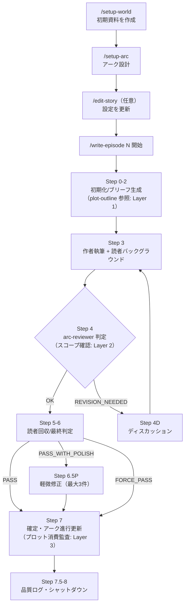

# Agentic Writing 仕様書（SPEC）

## 1. 主目的

### 1.1 主目的
`/setup-world`・`/edit-story`・`/write-episode` の3コマンドを通じて、Web小説制作の初期設定、継続的な設定更新、エピソード執筆と品質管理を再現可能な手順として提供する。

### 1.2 成功条件
- 作品資料（`story/`）が整合性を維持して生成・更新される。
- エピソード本文（`episodes/`）がレビューと読者評価を経て確定される。
- 執筆中断時に `workspace/progress.md` から再開できる。
- 品質記録（`story/quality-log.md`）と運用履歴（`archive/`）が残る。

## 2. 概要

### 2.1 システム概要
Agentic Writing は、複数エージェントの役割分担により小説執筆を進行するオーケストレーション仕様である。

- `author`（作者）: 本文執筆・改稿（opus）
- `arc-reviewer`（アークレビュアー）: 役割タグ準拠評価・台詞スタイル検査・改稿判定（sonnet）
- `reader-*`（読者）: ペルソナ別感想・評価（sonnet）
- `editor`（編集）: `/edit-story` スキルでのみ使用。`/write-episode` では廃止済み

### 2.2 ドキュメント責務
- `SPEC.md`: 目的、契約、成果物、判定基準などの正規仕様
- `docs/workflows.md`: 手順詳細、分岐、レジューム、Mermaid 詳細図

## 3. スコープ

### 3.1 対象
- `/setup-world`: 7ステップ対話で `story/` の初期資料を生成
- `/setup-arc`: 巻のシナリオアーク・キャラクターアークを設計（`/write-episode` の前提）
- `/edit-story <自然言語指示>`: 既存資料の更新と波及影響管理
- `/write-episode <話数> [--max-revisions=N]`: 執筆、評価、改稿ループ、確定保存

### 3.2 スコープ外
- モデル課金や実行基盤運用
- 外部公開プラットフォーム連携
- UI 実装

## 4. 公開インターフェース

### 4.1 コマンド I/F
| コマンド | 入力 | 出力 |
| --- | --- | --- |
| `/setup-world` | 対話回答（ジャンル・設定・文体等） | `story/*.md`（初期資料） |
| `/setup-arc` | 対話による設計承認 | `story/scenario-arc.md` + `story/character-arcs.md` + `story/series-tracker.md`（初期化） |
| `/edit-story` | 自然言語変更指示 | 対象 `story/*.md` の更新 |
| `/write-episode` | 話数、任意で `--max-revisions` | `episodes/*.txt` + `story/` 更新 + `archive/` 保存 |

### 4.2 判定 I/F
- arc-reviewer 判定（`workspace/arc-review.md`）
  `OK | REVISION_NEEDED | MAJOR_REVISION`
- リーダー最終判定（Step 6）
  `PASS | PASS_WITH_POLISH | FORCE_PASS`

### 4.3 進捗 I/F
`workspace/progress.md` を実行状態の唯一の復帰点として扱う。最低限次を保持する。
- `episode`
- `max_revisions`
- `revision_count`
- `current_step`
- `step_status`

## 5. 全体の処理の流れ

### 5.1 初期構築フロー（`/setup-world`）
1. カテゴリ・ジャンル選択
2. テーマ・コンセプト確定
3. 世界観設定
4. キャラクター定義
5. プロット骨格定義
6. 文体ガイド・AI癖制御定義
7. 読者ペルソナ定義
8. `story/` への一括出力

### 5.2 編集フロー（`/edit-story`）
1. 指示解析（対象・変更内容・規模）
2. 対象/関連ファイル読込
3. 波及影響分析
4. ユーザー承認
5. 変更反映
6. 変更レポート

### 5.3 執筆フロー（`/write-episode`）
1. 再開判定（`progress.md`）
2. Step 0-8 の順次実行
   - Step 2 のブリーフ生成時は `story/plot-outline.md` を参照し、今話のプロット骨格と整合を取る。**series-tracker の警告（キャラクター登場密度・伏線未進展）と plot-outline の計画が矛盾する場合は plot-outline を優先する**
3. 条件付き分岐
   - `step2q`: 設計者への問い（アーク解釈に不明点がある場合）
   - `step4d`: レビュー後ディスカッション（REVISION_NEEDED 時）
   - `step6.5p`: PASS_WITH_POLISH 時の軽微修正
   - `step7.5`: 品質ログ記録
4. ループ
   - REVISION_NEEDED 時は Step 3 に戻る
   - `revision_count >= max_revisions` で `FORCE_PASS`

### 5.4 再開・復旧フロー
- 同一話数の `progress.md` があれば再開
- 異なる話数の `progress.md` があれば確認のうえ新規開始
- `progress.md` 破損時は警告して新規開始へフォールバック
- `story/series-tracker.md` 欠落/破損時はテンプレート再生成して継続

## 6. 途中生成物

### 6.1 実行中生成物（`workspace/`）
| ファイル | 生成/更新タイミング | 役割 |
| --- | --- | --- |
| `workspace/episode-brief.md` | Step 2（オーケストレーターが直接生成） | エピソードブリーフ（plot-outline との整合確認含む） |
| `workspace/current-draft.txt` | Step 3（改稿ごとに更新） | 執筆本文 |
| `workspace/arc-review.md` | Step 4 | アークレビュアー評価 |
| `workspace/reader-feedback-*.md` | Step 3後バックグラウンド生成、Step 5回収 | 読者FB |
| `workspace/revision-log.md` | Step 0 初期化、改稿時追記 | 改稿履歴 |
| `workspace/discussion-log.md` | Step 0 初期化、各ディスカッション追記 | 議論記録 |
| `workspace/progress.md` | Step 0 作成、全ステップで更新 | 再開制御 |

### 6.2 初期資料生成物（`/setup-world`）
| ファイル | 役割 |
| --- | --- |
| `story/premise.md` | コンセプト・テーマ・想定話数 |
| `story/setting.md` | 世界観 |
| `story/characters.md` | 登場人物・口調 |
| `story/plot-outline.md` | プロット骨格 |
| `story/writing-guide.md` | 文体・AI癖制御 |
| `story/reader-personas.md` | 読者ペルソナ |
| `story/episode-summaries.md` | 要約テンプレート |
| `story/handover-notes.md` | 申し送りテンプレート |
| `story/quality-log.md` | 品質ログテンプレート |

### 6.3 アーク設計生成物（`/setup-arc`）
| ファイル | 役割 |
| --- | --- |
| `story/scenario-arc.md` | 感情命題・三幕構成・感情頂点・書かないこと宣言・役割マップ |
| `story/character-arcs.md` | 各キャラクターの変容ステージ・合流ポイント・未解決期間 |
| `story/series-tracker.md` | 横断追跡テンプレート（未存在時のみ新規作成） |

## 7. 最終生成物

| ファイル | 出力タイミング | 役割 |
| --- | --- | --- |
| `episodes/{番号:2桁}_{タイトル}.txt` | Step 7 | 確定本文 |
| `story/episode-summaries.md` | Step 7 | 直近話/アーク要約更新 |
| `story/character-arcs.md` | Step 7(a) | 現在ステージ更新 |
| `story/handover-notes.md` | Step 7(b) | アーク進行状況・スレッド再評価・`[PLOT-DRIFT]` 記録 |
| `story/series-tracker.md` | Step 7(c) | 横断指標・アーク乖離チェック更新 |
| `story/plot-outline.md` | Step 7(d)（乖離時） | プロット消費監査で乖離検出時のみ記録 |
| `story/quality-log.md` | Step 7.5 | 品質記録 |
| `archive/episode-{番号:2桁}/` | Step 8 | 監査・再検証用保存（`workspace/` 退避） |

## 8. 品質判定仕様

### 8.1 判定ロジック（Step 6）
1. メタナラティブ自動スキャン（`第\d+話` パターンがタイトル行以外に存在しないか）
2. `force_pass: true` なら `FORCE_PASS`
3. arc-reviewer 判定と reader 評価（平均・中央値）を集計
4. arc-reviewer が `OK` の場合、PASS_WITH_POLISH 条件を確認:
   - arc-review に軽微問題2件以上 / 読者2名以上の共通指摘 / 読者平均★3.0未満
   → いずれかに該当で `PASS_WITH_POLISH`、いずれにも非該当で `PASS`
5. 読者間★差2以上の場合は差分分析を実施し handover-notes に記録

### 8.2 書面先行・判定不変
- `arc-review.md` 検証完了後にのみ Step 4D を開始する
- ディスカッションは判定変更を目的にしない（モデル非対称性への対策）

### 8.3 軽微修正（PASS_WITH_POLISH）
- 修正対象は最大3件
- 全体構成は変更しない
- arc-reviewer 再レビュー・reader 再評価は行わない

### 8.4 プロット乖離検知（3層構成）

| 層 | タイミング | 実行者 | 検知内容 |
|----|-----------|--------|---------|
| Layer 1（予防） | Step 2 ブリーフ生成 | Orchestrator | plot-outline を参照し、series-tracker 警告より plot-outline を優先 |
| Layer 2（検知） | Step 4 レビュー | arc-reviewer | ブリーフスコープ確認——brief に記載のないキャラ初登場・主要イベント消費を検出 |
| Layer 3（事後監査） | Step 7 確定時 | Orchestrator | plot-outline vs 実際の展開を照合。乖離は `[PLOT-DRIFT]` で handover-notes に記録 |

## 9. 失敗時挙動・復旧

### 9.1 エージェント出力検証失敗
- 期待ファイル不存在または内容不足は同一エージェントへ再指示
- リトライ上限2回
- 上限到達時はワークフロー中断

### 9.2 データ欠落/破損
- `series-tracker.md` 欠落/必須見出し不足は自動再生成
- `progress.md` 不正は新規開始にフォールバック

### 9.3 途中中断
- `progress.md` の `current_step` と `step_status` を基準に再開先を決定
- ディスカッションステップは非永続のため再実行する

## 10. 制約・運用原則

- `workspace/` は実行中の一時領域、確定後は `archive/` へ退避する
- `story/` は中長期の正本資料として扱う
- `episodes/` は公開対象の確定本文のみを置く
- 読者ペルソナ数は `story/reader-personas.md` 定義に従い可変

## 11. ワークフロー（Mermaid）

```mermaid
flowchart TD
    A["/setup-world<br/>初期資料を作成"] --> AA["/setup-arc<br/>アーク設計"]
    AA --> B["/edit-story（任意）<br/>設定を更新"]
    B --> C["/write-episode N 開始"]
    C --> D["Step 0-2<br/>初期化/ブリーフ生成<br/>（plot-outline 参照: Layer 1）"]
    D --> E["Step 3<br/>作者執筆 + 読者バックグラウンド"]
    E --> F{"Step 4<br/>arc-reviewer 判定<br/>（スコープ確認: Layer 2）"}
    F -->|OK| H["Step 5-6<br/>読者回収/最終判定"]
    F -->|REVISION_NEEDED| DD["Step 4D<br/>ディスカッション"]
    DD --> E
    H -->|PASS| I["Step 7<br/>確定・アーク進行更新<br/>（プロット消費監査: Layer 3）"]
    H -->|PASS_WITH_POLISH| P["Step 6.5P<br/>軽微修正（最大3件）"]
    P --> I
    H -->|FORCE_PASS| I
    I --> J["Step 7.5-8<br/>品質ログ・シャットダウン"]
```

詳細手順・分岐図・レジューム状態遷移は `docs/workflows.md` を参照する。
