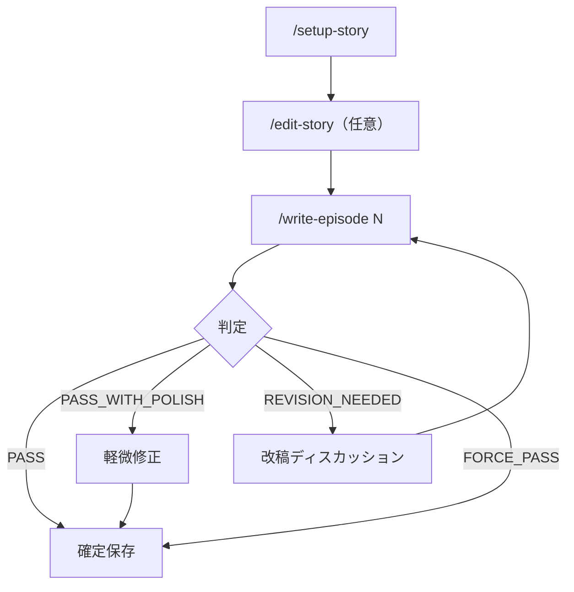
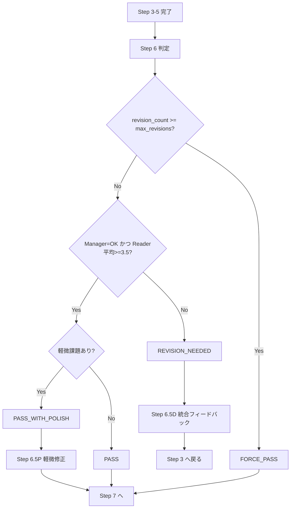
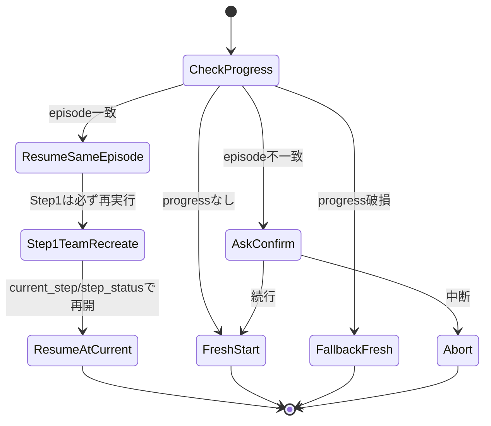

# Agentic Writing ワークフロー詳細

## 1. 全体フロー（高レベル）

## 2. `/setup-story` 詳細

### 2.1 ステップ
1. Step 1: カテゴリ・ジャンル選択
2. Step 2: テーマ・コンセプト
3. Step 3: 世界観・設定
4. Step 4: キャラクター
5. Step 5: プロット骨格
6. Step 6: 文体ガイド + AI癖制御
7. Step 7: 読者ペルソナ
8. 出力: `story/` 一括生成

### 2.2 出力契約
- コンテンツ系: `premise.md`, `setting.md`, `characters.md`, `plot-outline.md`, `writing-guide.md`, `reader-personas.md`
- テンプレート系: `episode-summaries.md`, `handover-notes.md`, `quality-log.md`, `series-tracker.md`

## 3. `/edit-story` 詳細

### 3.1 ステップ
1. 指示解析
2. 対象ファイル読込
3. 波及影響分析
4. 承認取得
5. 変更反映
6. 変更レポート

### 3.2 分岐
- 全承認: 提案どおり更新
- 部分承認: 対象限定で更新
- 却下: 変更なし
- 再提案: 修正後に再承認

## 4. `/write-episode` 詳細

### 4.1 基本ステップ
| Step | 名称 | 主担当 | 主な出力 |
| --- | --- | --- | --- |
| 0 | 初期化 | リーダー | `progress.md`, `revision-log.md`, `discussion-log.md` |
| 1 | チーム作成 + コアスポーン | リーダー | 実行環境、必要時 `series-tracker.md` 復旧 |
| 2 | 編集（方針策定） | editor | `current-direction.md` |
| 2D | 方針ディスカッション | editor/author/manager | `discussion-log.md`（必要時 direction更新） |
| 3 | 作者（執筆/改稿） | author | `current-draft.txt` |
| 4 | 担当者レビュー | manager | `manager-review.md` |
| 4D | ドラフトディスカッション | author/editor | `discussion-log.md` |
| 5 | 読者フィードバック回収 | reader-* | `reader-feedback-*.md` |
| 6 | 判定 | リーダー | PASS系/REVISION判定、`revision-log.md` 追記 |
| 6.5P | ポリッシュ（条件付き） | author | `current-draft.txt` 軽微修正 |
| 6.5D | リビジョンディスカッション（条件付き） | editor中心 | `consolidated-feedback.md` |
| 7 | 確定・保存 | リーダー | `episodes/*.txt` + `story/*` 更新 |
| 7.5 | 申し送り更新 | editor | `handover-notes.md` |
| 7.6 | プロット更新検討 | editor/manager | 必要時 `plot-outline.md` 更新 + `quality-log.md` |
| 8 | チームシャットダウン | リーダー | `workspace/` 最終退避・クリーンを含む実行終了 |

### 4.2 条件付きステップの要点
- `step2d`: 方針の実現可能性と品質懸念を事前解消
- `step4d`: レビュー指摘に対する意図確認（判定は不変）
- `step6.5p`: PASS_WITH_POLISH 時のみ、最大3点の軽微修正
- `step6.5d`: REVISION_NEEDED 時のみ、統合フィードバック作成後 Step3 に戻る
- `step7.5`/`step7.6`: 確定本文を前提に後処理を実施

## 5. 判定分岐と改稿ループ

## 6. レジューム（再開）状態遷移

## 7. Step 別のファイル生成タイムライン

| フェーズ | 追加/更新される主ファイル |
| --- | --- |
| `/setup-story` 完了時 | `story/*.md` 一式 |
| Step 0 | `workspace/progress.md`, `workspace/revision-log.md`, `workspace/discussion-log.md` |
| Step 2 | `workspace/current-direction.md` |
| Step 3 | `workspace/current-draft.txt` |
| Step 4 | `workspace/manager-review.md` |
| Step 5 | `workspace/reader-feedback-*.md` |
| Step 6.5D | `workspace/consolidated-feedback.md` |
| Step 7 | `episodes/{番号:2桁}_{タイトル}.txt`, `story/episode-summaries.md`, `story/series-tracker.md` |
| Step 7.5 | `story/handover-notes.md` |
| Step 7.6 | `story/quality-log.md`, （必要時）`story/plot-outline.md` |
| Step 8 終盤 | `archive/episode-{番号:2桁}/` へ `workspace/` 退避後、`workspace/` をクリーン |

## 8. 重要な運用ルール

- `manager-review.md` の検証完了前に Step 4D を開始しない。
- Step 5 は読者ごとの個別検証・個別リトライを行う。
- Step 8 の `workspace` 退避/クリーンは Step 7.5/7.6 完了後、`progress.md` の Step 8 完了更新後に実行する。
- `series-tracker.md` 欠落または必須見出し不足時は再生成して継続する。
