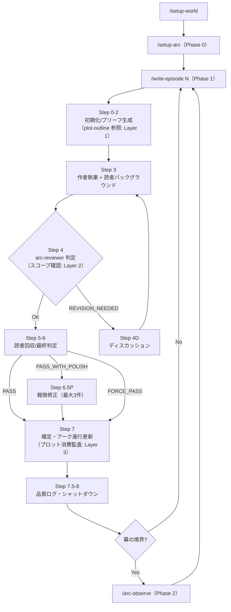
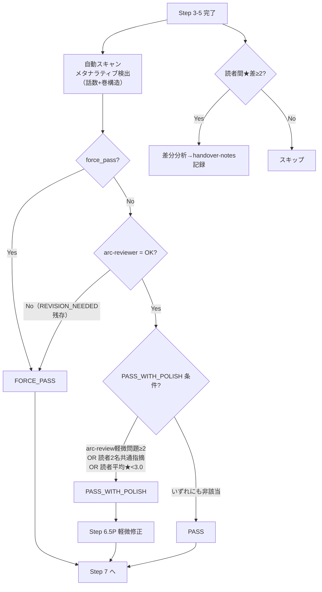
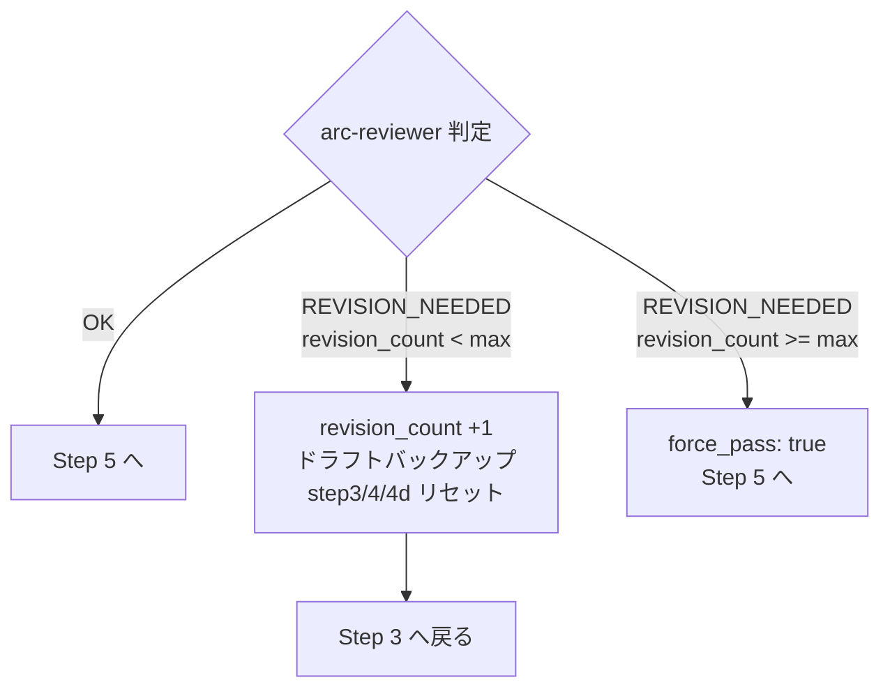
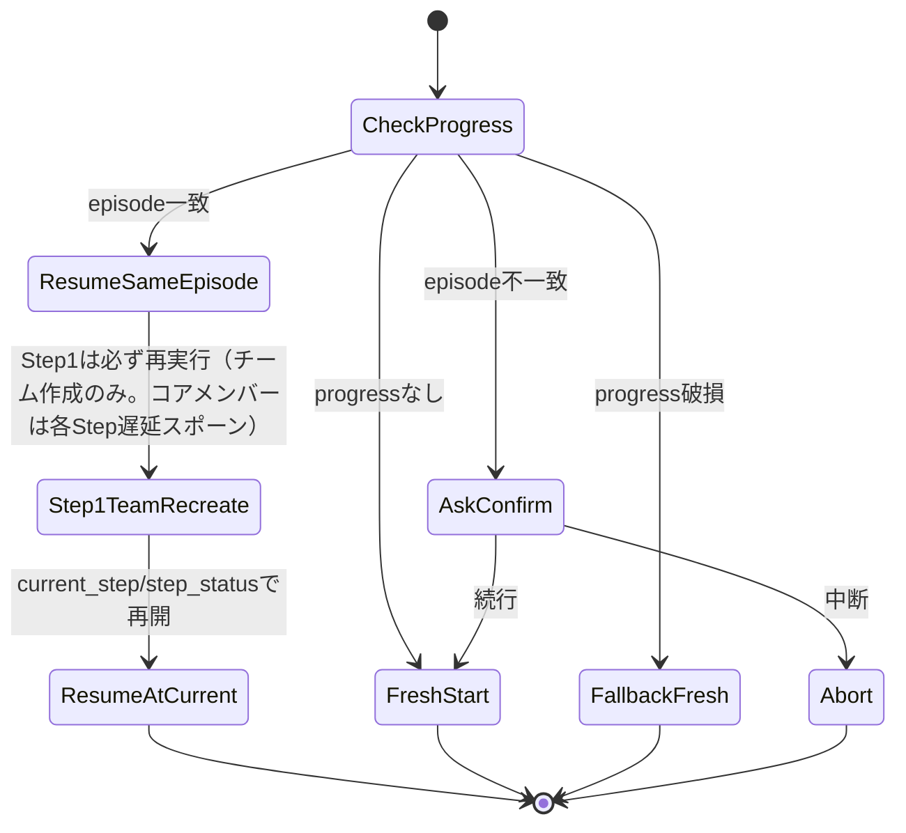

# Agentic Writing ワークフロー詳細

## 1. 全体フロー（高レベル）


```mermaid
flowchart TD
    SW["/setup-world"] --> SA["/setup-arc（Phase 0）"]
    SA --> W["/write-episode N（Phase 1）"]
    W --> D["Step 0-2\n初期化/ブリーフ生成\n（plot-outline 参照: Layer 1）"]
    D --> X["Step 3\n作者執筆 + 読者バックグラウンド"]
    X --> AR{"Step 4\narc-reviewer 判定\n（スコープ確認: Layer 2）"}
    AR -->|OK| H["Step 5-6\n読者回収/最終判定"]
    AR -->|REVISION_NEEDED| DD["Step 4D\nディスカッション"]
    DD --> X
    H -->|PASS| FIN["Step 7\n確定・アーク進行更新\n（プロット消費監査: Layer 3）"]
    H -->|PASS_WITH_POLISH| P["Step 6.5P\n軽微修正（最大3件）"]
    P --> FIN
    H -->|FORCE_PASS| FIN
    FIN --> END["Step 7.5-8\n品質ログ・シャットダウン"]
    END --> B{"幕の境界?"}
    B -->|Yes| AO["/arc-observe（Phase 2）"]
    AO --> W
    B -->|No| W
```

## 2. `/setup-world` 詳細

### 2.1 モード
| モード | 選択肢 | 流れ |
|-------|--------|-----|
| 新規作成 | A | Steps 1〜7 → `story/` 出力。その後 `/setup-arc` へ |
| 既存作品インポート | B | Steps I-0〜I-7（設定生成）→ Phase 2（アーク設計）→ `/write-episode N` へ |

### 2.2 新規作成ステップ
1. Step 1: カテゴリ・ジャンル選択
2. Step 2: テーマ・コンセプト
3. Step 3: 世界観・設定
4. Step 4: キャラクター
5. Step 5: プロット骨格
6. Step 6: 文体ガイド + AI癖制御（構成パターン推奨相性表・感覚レンズを含む）
7. Step 7: 読者ペルソナ
8. 出力: `story/` 一括生成

### 2.3 インポートモードステップ

**Phase 1 — 設定ファイル生成:**
| Step | 出力ファイル |
|------|------------|
| I-0 | — （素材確認・既存話数記録） |
| I-1 | `premise.md` |
| I-2 | `setting.md` |
| I-3 | `characters.md` |
| I-4 | `plot-outline.md` |
| I-5 | `writing-guide.md` |
| I-6 | `reader-personas.md` |
| I-7 | `episode-summaries.md`, `handover-notes.md`, `series-tracker.md`, `quality-log.md` |

**Phase 2 — アーク設計:** `/setup-arc` Steps A〜G を実行（Step 0 はスキップ）

### 2.4 中断復帰（インポートモード）
`story/` 内のファイル存在で進捗を判定し、未生成ファイルに対応するステップから再開する。

### 2.5 出力契約
- コンテンツ系: `premise.md`, `setting.md`, `characters.md`, `plot-outline.md`, `writing-guide.md`, `reader-personas.md`
- テンプレート系: `episode-summaries.md`, `handover-notes.md`, `quality-log.md`

## 3. `/setup-arc` 詳細（Phase 0）

### 3.1 ステップ

```
Step 0  初期化（中断復帰チェック / 新規・続巻・インポート継続の確認）
Step A  テーマの言語化（感情命題に向けた対話）
Step B  シナリオアーク草案生成 + チェックリスト初期化
Step C  Claude が問いを提示（選択肢5択形式）→ 設計者が回答 → 草案更新
        ※ 構造的完全性チェック全項目完了まで繰り返す
Step D  キャラクターアーク草案生成
Step E  同上ループ（追加チェック完了まで）
Step F  エピソード役割マップ完成（全話に役割タグを割り当て）
Step G  設計者承認 → アーク設計ロック（執筆解禁）
```

### 3.2 役割タグ定義
| タグ | 定義 |
|-----|------|
| **頂点** | 幕の感情的クライマックス。一つの主題に集中 |
| **助走** | 次の頂点に向けて緊張を高める |
| **余韻** | 頂点の感情を沈殿させる。新イベント消費・伏線回収・アーク進行は禁止。ただし既存感情の別角度照射、キャラ間の微細な関係変化、主人公の個の時間は積極的に描く。前話群と異なる実装構造で描くこと |
| **転換** | 物語の方向を変える。新情報は一つだけ |
| **蓄積** | 世界観・関係性を積み上げる |

### 3.3 出力契約
| ファイル | 内容 |
|---------|------|
| `story/scenario-arc.md` | 感情命題・三幕構成・感情頂点・書かないこと宣言・役割マップ |
| `story/character-arcs.md` | 変容ステージ・合流ポイント・意図的未解決期間 |
| `story/series-tracker.md` | 横断追跡テンプレート（未存在時のみ新規作成） |
| `story/arc-design-progress.md` | チェックリスト状態（LOCKED で執筆解禁） |

### 3.4 中断復帰
`story/arc-design-progress.md` の状態から再開。LOCKED ならアーク設計完了。

## 4. `/edit-story` 詳細

### 4.1 ステップ
1. 指示解析
2. 対象ファイル読込
3. 波及影響分析
4. 承認取得
5. 変更反映
6. 変更レポート

### 4.2 分岐
- 全承認: 提案どおり更新
- 部分承認: 対象限定で更新
- 却下: 変更なし
- 再提案: 修正後に再承認

## 5. `/write-episode` 詳細（Phase 1）

### 5.1 エージェント構成

| エージェント | subagent_type | モデル | 役割 |
| --- | --- | --- | --- |
| 作者 (author) | novel-author | opus | 本文執筆・改稿 |
| アークレビュアー (arc-reviewer) | novel-arc-reviewer | sonnet | 役割タグ準拠評価・ブリーフスコープ確認・改稿判定 |
| 読者×N | novel-reader-* | sonnet | ペルソナベースのフィードバック（初稿のみ） |

### 5.2 基本ステップ

| Step | 名称 | 主担当 | 主な出力 |
| --- | --- | --- | --- |
| 0 | 初期化 | Orchestrator | `progress.md`, `revision-log.md`, `discussion-log.md` |
| 1 | チーム作成（コアメンバーは遅延スポーン） | Orchestrator | 実行環境、必要時 `series-tracker.md` 復旧 |
| 2 | エピソードブリーフ生成 | Orchestrator | `episode-brief.md`（アーク設計から導出・執筆アクセント・plot-outline 参照含む） |
| 2Q | 設計者への問い（任意） | Orchestrator | `discussion-log.md` 追記 |
| 3 | 作者（執筆/改稿） | author | `current-draft.txt`, `author-reflections.md`, `accent-note.md`（変更時のみ） |
| 3bg | 読者バックグラウンドスポーン | Orchestrator | 初稿時のみ。読者を並列起動 |
| 4 | アークレビュー | arc-reviewer | `arc-review.md`（ブリーフスコープ確認: Layer 2） |
| 4D | ドラフトディスカッション | author + arc-reviewer | `discussion-log.md`（REVISION_NEEDED 時は Step 3 へ） |
| 5 | 読者フィードバック回収 | Orchestrator | `reader-feedback-*.md` 検証 |
| 6 | 判定 | Orchestrator | PASS / PASS_WITH_POLISH / FORCE_PASS |
| 6.5P | ポリッシュ（条件付き） | author | `current-draft.txt` 軽微修正（最大3件） |
| 7 | 確定・保存・アーク進行更新 | Orchestrator | `episodes/*.txt`, `story/*` 更新（プロット消費監査: Layer 3） |
| 7.5 | 品質ログ記録 | Orchestrator | `quality-log.md` |
| 8 | チームシャットダウン | Orchestrator | `archive/` 退避、`workspace/` クリーン |

### 5.3 条件付きステップの要点
- **Step 2Q**: アーク設計の解釈に不明点がある場合のみ。設計変更が必要な問いは `[DESIGN-REVIEW]` で記録
- **Step 4D**: arc-review の判定は変更しない（書面先行・判定不変ルール）。最大2ラウンド
- **Step 6.5P**: PASS_WITH_POLISH 時のみ。arc-reviewer 再レビュー・reader 再評価は不要
- **Step 7(a)-(e)**: 確定後のサブステップ:
  - (a) character-arcs.md 現在ステージ更新
  - (b) handover-notes.md アーク進行状況更新
  - (c) series-tracker.md 更新（構成パターン履歴・感覚レンズ履歴・テンポプロファイル履歴・能動性追跡・シーン構造パターン・半透明パターン・アーク乖離チェック含む）
  - (d) プロット消費監査（Layer 3）— 乖離時は `[PLOT-DRIFT]` で記録
  - (e) アーク観測の通知（幕境界の場合のみ）

### 5.4 Step 2 の執筆アクセントと品質保証
`series-tracker.md` の直近5話履歴から以下を `episode-brief.md` に追記（**示唆。変更可**）:
- **構成パターン推奨**: 10型（冒頭クライマックス・日常崩壊・静謐一貫・謎解き・時間跳躍・会話劇・並走・対比・積層・単線）から重複回避して推奨
- **感覚レンズ推奨**: 4分類（視覚・聴覚・触覚・嗅覚味覚）から重複回避して推奨
- **テンポプロファイル**: 6種（圧縮・展開・加速・衝撃・減速・波動）から直前2話と重複回避して選定
- **蓮の選択場面（必須）**: 判断 or 決断を設計。選ばなかった選択肢も明示
- **引きの型**: 4類型（明示的謎・不安の種・感情の残響・選択の予感）から直前2話と重複回避
- **反パターン制約（必須）**: `series-tracker.md` のシーン構造パターンテーブルから直近3話の実装構造を取得し、重複する主構造・冒頭・食事場面等を明示的に禁止

変更した場合は `workspace/accent-note.md` を生成 → Step 7 で `series-tracker.md` の変更メモ列に転記後削除。

### 5.5 モデル非対称性への対策

arc-reviewer（Sonnet）が author（Opus）に議論で言い負かされるリスクを防止:
- **書面先行ルール**: arc-reviewer は `arc-review.md` を書き切ってから議論に参加する
- **判定不変の原則**: 書面に記載した判定は議論で変更しない
- **議論の非対称制限**: author → arc-reviewer は「意図の説明」のみ許可。「判定への異議」は禁止

## 6. 判定分岐と改稿ループ


```mermaid
flowchart TD
    A["Step 3-5 完了"] --> S0["自動スキャン<br/>メタナラティブ検出<br/>（話数+巻構造）"]
    S0 --> C{"force_pass?"}
    C -->|Yes| FP["FORCE_PASS"]
    C -->|No| D{"arc-reviewer = OK?"}
    D -->|No（REVISION_NEEDED残存）| FP
    D -->|Yes| E{"PASS_WITH_POLISH 条件?"}
    E -->|"arc-review軽微問題≥2\nOR 読者2名共通指摘\nOR 読者平均★<3.0"| PWP["PASS_WITH_POLISH"]
    E -->|いずれにも非該当| PASS["PASS"]

    PWP --> POL["Step 6.5P 軽微修正"]
    POL --> FIN["Step 7 へ"]
    PASS --> FIN
    FP --> FIN

    A --> GAP{"読者間★差≥2?"}
    GAP -->|Yes| ANAL["差分分析→handover-notes記録"]
    GAP -->|No| SKIP["スキップ"]
```

### 改稿ループ（Step 4D 遷移）


```mermaid
flowchart TD
    R{"arc-reviewer 判定"}
    R -->|OK| S5["Step 5 へ"]
    R -->|"REVISION_NEEDED\nrevision_count < max"| REV["revision_count +1\nドラフトバックアップ\nstep3/4/4d リセット"]
    REV --> S3["Step 3 へ戻る"]
    R -->|"REVISION_NEEDED\nrevision_count >= max"| FP["force_pass: true\nStep 5 へ"]
```

## 7. `/arc-observe` 詳細（Phase 2）

### 7.1 起動条件
Step 7 確定後、`progress.md` の `arc_phase_boundary = true` の場合、オーケストレーターがユーザーに通知し手動起動を促す。

### 7.2 ステップ
| Step | 内容 |
|------|------|
| 1 | `episodes/` 内の全 `.txt` を話数順に通読 |
| 2 | `story/author-reflections.md` を通読（存在する場合） |
| 3 | `story/scenario-arc.md`・`story/character-arcs.md` と照合 → `workspace/arc-observation-report.md` 生成 |
| 4 | 細部修正を自律実施。大筋修正は設計者に問い（A.承認/B.却下/C.修正）で確認後実施 |
| 5 | 承認された変更を `story/` に反映 → `archive/arc-observe-vol{N}-act{N}/` にレポート保存 |

### 7.3 提案権限
| 区分 | 内容 |
|-----|------|
| **細部**（設計者確認不要） | 合流ポイントの話数 ±2 話以内移動 / 「書かないことの宣言」への項目追加 / handover-notes スレッドタグ再評価 |
| **大筋**（設計者確認が必要） | 感情頂点の話数移動 / 三幕構成幕境界変更 / キャラクターアーク変容ステージ追加・削除 / 感情命題修正 / 「書かないことの宣言」からの項目削除 |

## 7.5 プロット乖離検知（3層構成）

| 層 | タイミング | 実行者 | 検知内容 |
|----|-----------|--------|---------|
| Layer 1（予防） | Step 2 ブリーフ生成 | Orchestrator | plot-outline を参照し、series-tracker 警告より plot-outline を優先 |
| Layer 2（検知） | Step 4 レビュー | arc-reviewer | ブリーフスコープ確認——brief に記載のないキャラ初登場・主要イベント消費を検出 |
| Layer 3（事後監査） | Step 7(d) 確定時 | Orchestrator | plot-outline vs 実際の展開を照合。乖離は `[PLOT-DRIFT]` で handover-notes に記録 |

## 8. レジューム（再開）状態遷移


```mermaid
stateDiagram-v2
    [*] --> CheckProgress
    CheckProgress --> FreshStart: progressなし
    CheckProgress --> ResumeSameEpisode: episode一致
    CheckProgress --> AskConfirm: episode不一致
    CheckProgress --> FallbackFresh: progress破損

    AskConfirm --> FreshStart: 続行
    AskConfirm --> Abort: 中断
    ResumeSameEpisode --> Step1TeamRecreate: Step1は必ず再実行（チーム作成のみ。コアメンバーは各Step遅延スポーン）
    Step1TeamRecreate --> ResumeAtCurrent: current_step/step_statusで再開
    ResumeAtCurrent --> [*]
    FreshStart --> [*]
    FallbackFresh --> [*]
    Abort --> [*]
```

## 9. Step 別のファイル生成タイムライン

| フェーズ | 追加/更新される主ファイル |
| --- | --- |
| `/setup-world` 完了時 | `story/*.md` 一式（設定ファイル + テンプレート） |
| `/setup-arc` 完了時 | `story/scenario-arc.md`, `story/character-arcs.md`, `story/arc-design-progress.md`, `story/series-tracker.md`（初期化） |
| Step 0 | `workspace/progress.md`, `workspace/revision-log.md`, `workspace/discussion-log.md` |
| Step 2 | `workspace/episode-brief.md` |
| Step 3 | `workspace/current-draft.txt`, `story/author-reflections.md`, `workspace/accent-note.md`（変更時のみ） |
| Step 4 | `workspace/arc-review.md` |
| Step 3bg→5 | `workspace/reader-feedback-*.md` |
| Step 7 | `episodes/{番号:2桁}_{タイトル}.txt`, `story/episode-summaries.md`, `story/character-arcs.md`, `story/handover-notes.md`, `story/series-tracker.md` |
| Step 7(d) | （乖離時のみ）`story/handover-notes.md` に `[PLOT-DRIFT]` 追記 |
| Step 7.5 | `story/quality-log.md` |
| Step 8 | `archive/episode-{番号:2桁}/` へ `workspace/` 退避後クリーン |
| `/arc-observe` Step 5 | `story/scenario-arc.md`（変更時）, `story/character-arcs.md`（変更時）, `story/handover-notes.md`, `archive/arc-observe-vol{N}-act{N}/` |

## 10. 重要な運用ルール

- `arc-review.md` の検証完了前に Step 4D を開始しない（書面先行ルール）
- Step 4D のディスカッションは判定変更を目的にしない（判定不変の原則）
- Step 5 は読者ごとの個別検証・個別リトライを行う
- Step 2 で series-tracker の警告と plot-outline が矛盾する場合は **plot-outline を優先**する
- series-tracker のキャラクター登場密度で、plot-outline に初登場が後の話に計画されているキャラの初登場前 `×` は警告対象外
- Step 8 の `workspace/` 退避・クリーンは Step 7.5 完了後、`progress.md` の Step 8 完了更新後に実行する
- `series-tracker.md` 欠落または必須見出し不足時は再生成して継続する
- `story/scenario-arc.md` と `story/character-arcs.md` がなければ `/write-episode` は開始しない
