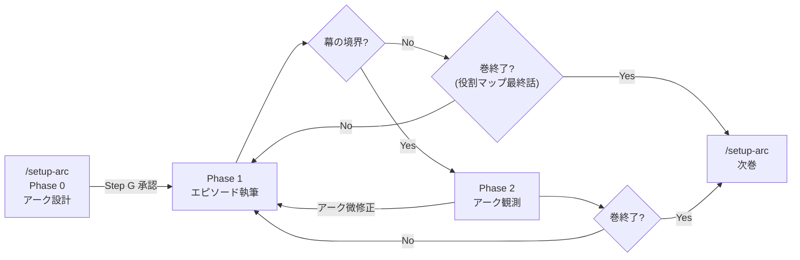
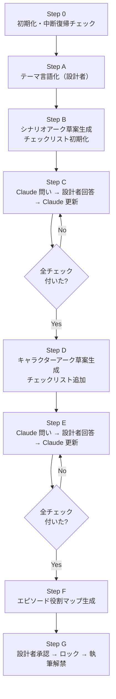
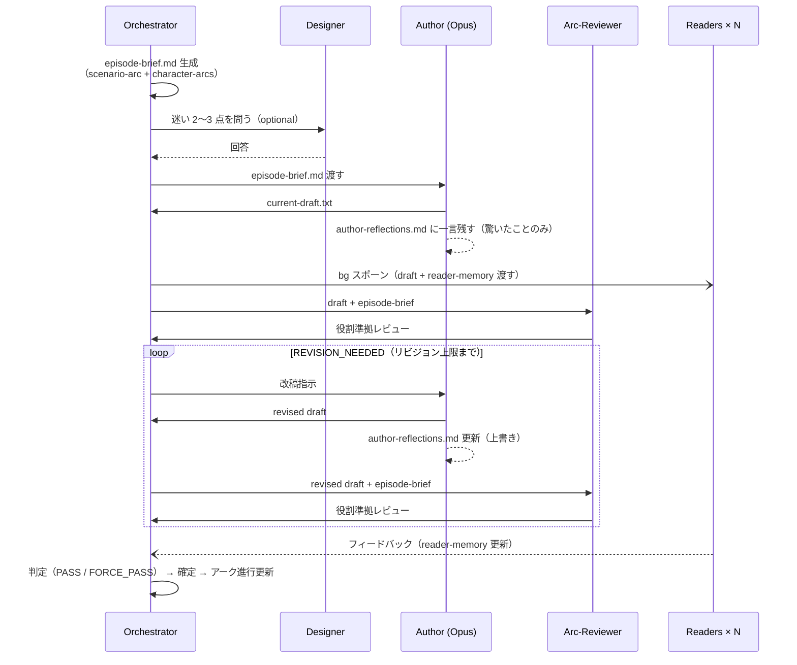
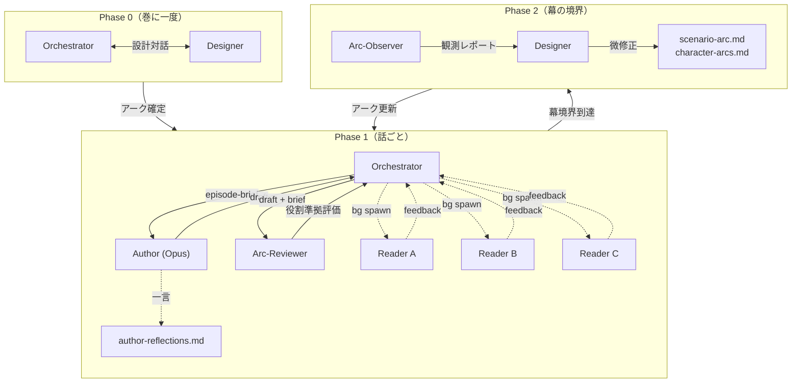

# 次世代執筆システム 設計書

*これまでの議論・外部提案・作品通読の経験を統合した設計*

---

## 設計原則

### 1. 降ろし型：上位が下位の判断基準を与える

```
テーマ
  └── シナリオアーク（巻単位の形）
        └── キャラクターアーク（シナリオアークと協調）
              └── 各エピソード（アーク上の役割を持つ）
                    └── handover-notes（アーク進行の記録）
                    └── series-tracker（表現傾向の監視 ＋ アーク位置との乖離チェック）
```

現行システムは積み上げ型（handover-notes → editor判断 → 執筆）だった。次は降ろし型にする。下位の意思決定は常に上位の設計を参照する。

### 2. 設計フェーズと執筆フェーズを分離する

アーク設計が完了し、設計者が承認するまでエピソード執筆を開始しない。設計と実行が同じループ内で混在する現行の構造を解体する。

### 3. 記録ではなく記憶を蓄積する

システムに与えるのは「記録する仕組み」ではなく「何を覚えておくべきかの判断基準」。アーク設計がその基準を提供し、handover-notesはアーク進行の記録として機能する。不要なものを手放す判断（トリアージ）がアーク設計から導かれる。

### 4. 設計者がアノテーションを入れる場所を持つ

Claudeがアーク草案を生成し、設計者がそれに注釈を加えるサイクルを経て確定する。設計者の意図・ドメイン知識・却下事項がアーク設計に刻まれてから執筆が始まる。

---

## フェーズ構成



### Phase 0：アーク設計（巻に一度） — **【実装済み】**（`/setup-arc`）

エピソード執筆の前に完結する。設計者の承認なしに次フェーズへ進まない。中断・再開に対応するため、進捗を `story/arc-design-progress.md` に逐次記録する。

```
Step 0  初期化：中断復帰チェック ＋ 新規/続巻の確認（ファイルパス取得）
Step A  テーマの言語化（設計者が持ち込む）
Step B  シナリオアーク草案（Claude生成）+ チェックリスト初期化
Step C  Claudeが問う → 設計者が答える → Claude更新（チェックが全部付くまで繰り返す）
Step D  キャラクターアーク草案（Claude生成）+ チェックリスト追加
Step E  Claudeが問う → 設計者が答える → Claude更新（チェックが全部付くまで繰り返す）
Step F  エピソード役割マップ生成
Step G  設計者承認 → アーク設計ロック → 執筆解禁
```



#### チェックリストの構成

チェックリストには二種類の項目が混在する。**両方にチェックが付くまでClaudeは次の段階に進まない。**

**構造的完全性（固定）** — アーク設計として必要な要素が揃っているか：
- [ ] 感情命題が一文で定義されている
- [ ] 三幕構成と各幕の感情の方向が決まっている
- [ ] 各幕に感情頂点が一つずつ指定されている
- [ ] 「本巻で書かないこと」が宣言されている
- [ ] 各話の役割タグが割り当てられている（Step F 後）

**Claudeの仮定（可変）** — 草案生成時にClaudeが仮定で埋めた箇所：
- 草案ごとに内容が変わる。Claudeが仮定で埋めた箇所を **3〜5点** 特定し、**5択選択式**（方向性の異なる案を並べ、設計者が選んで答えられる形式）で問う。答えたらチェックが付く

問いは設計者が気づいていない前提の衝突を掘り起こすためにある。設計者は答えるだけでいい。

#### 中断復帰

`story/arc-design-progress.md` にチェックリストの現在状態を記録する。セッションを跨いでも「どこまで確定したか、残りの問いは何か」から再開できる。

成果物：`story/scenario-arc.md`（エピソード役割マップを含む）、`story/character-arcs.md`、`story/arc-design-progress.md`

### Phase 1：エピソード執筆（話ごとに繰り返す） — **【未実装】**（次の実装対象）

現行の write-episode スキルに相当。ただし設計の起点がアーク設計に変わる。

```
Step 0  初期化
Step 1  チーム作成
Step 2  エピソードブリーフ生成（アーク設計から導出）
Step 3  作者執筆 → author-reflections.md に一言（驚いたことのみ） → 読者バックグラウンドスポーン（draft を渡す）
Step 4  アークレビュー（役割準拠の評価）
         REVISION_NEEDED の場合 → Step 3 に戻る（リビジョン上限まで。上限到達 → FORCE_PASS）
Step 5  読者フィードバック回収
Step 6  判定
Step 7  確定・保存・アーク進行更新
Step 8  シャットダウン
```



### Phase 2：アーク観測（幕の境界で実施） — **【未実装】**

執筆しながら生まれる創発を、シリーズレベルで検出・反映する。`story/scenario-arc.md` の三幕構成から境界話数を取得し、その話の確定後に自動スポーン（第二部の三幕構成なら7話後・16話後の2回など、幕数に応じて実施回数が変わる）。

```
Step 1  アークオブザーバーが全確定エピソードを通読
Step 2  story/author-reflections.md を通読し、執筆行為の中で蓄積された意図を抽出する
Step 3  設計アークと実際の展開のずれを報告
Step 4  設計者と協議 → シナリオアーク・キャラクターアークの微修正（許容範囲内）
Step 5  handover-notes.md のアーク進行状況を更新後のアーク設計と照合・差分を修正する
```

大筋の変更（テーマ・感情頂点の移動）は設計者判断が必要。細部の調整（合流ポイントの話数移動など）はPhase 2で対応できる。

---

## ドキュメント設計

### 新設：`story/arc-design-progress.md` — **【実装済み】**

Phase 0 の中断復帰用ファイル。`workspace/progress.md` の Phase 0 版。

```markdown
## Phase 0 進捗（第N巻）

### 現在のStep
（Step 0〜G のどこにいるか）

### チェックリスト

#### 構造的完全性
- [x] 感情命題
- [x] 三幕構成
- [ ] 感情頂点（未確定）
- [ ] 書かないことの宣言
- [ ] 役割タグ（Step F 後）

#### Claudeの仮定（残りの問い）
- [ ] 〇〇について：私は△△と解釈しました。確認待ち
```

全項目にチェックが付き、設計者が Step G で承認したら Phase 0 完了。このファイルを `archive/phase0/` にアーカイブし、`story/scenario-arc.md` ・`story/character-arcs.md` を確定版として扱う。

### 新設：`story/scenario-arc.md` — **【実装済み】**

```markdown
## 巻の感情命題
この巻を読み終えた読者が持ち帰る感情を一文で定義する。
すべての取捨選択の最上位基準。

## 三幕構成
| 幕 | 話数範囲 | フェーズ名 | 感情の方向 |
|----|---------|-----------|-----------|

## 感情頂点
各幕に一つだけ指定する。頂点以外の話は頂点より感情強度を下げる。
| 頂点 | 話数 | 内容 |
|------|------|------|

## 本巻で書かないことの宣言
この巻では解決しない問い、次巻に温存する要素を明記する。
（これがないと終盤に全項目が累積する）

## エピソード役割マップ
| 話数 | 役割タグ | 感情強度（頂点比） | 備考 |
|------|---------|-----------------|------|
```

役割タグ：**頂点 / 助走 / 余韻 / 転換 / 蓄積**

### 新設：`story/character-arcs.md` — **【実装済み】**

```markdown
## [キャラクター名]

### アーク概要（一文）

### 変容ステージ
| ステージ | 状態 | 発動トリガー | 協調するシナリオフェーズ |
|---------|------|------------|----------------------|

### 合流ポイント
他キャラクターと遷移が交差するタイミング。一点に最大3キャラクターまで。
| CP名 | 話数目安 | 交差するキャラクター | 条件 |
|-----|---------|-----------------|-----|

### 意図的に未解決を保つ期間
アーク上の必要から、解決してはいけない話数範囲を明記する。
改稿圧力に対する根拠として機能する。
```

### 変更：`story/handover-notes.md` — **【未実装】**

**現行**：未解決項目のリスト（処理圧力を生む）
**変更後**：アーク進行の記録（判断基準を与える）

```markdown
## アーク進行状況（第N話終了時点）
| キャラクター | 現ステージ | 次トリガーまでの距離 | 意図的未解決期間中か |
|------------|---------|-----------------|-----------------|

## スレッド
各項目に以下のいずれかを付与する。
- [MUST-THIS]：この話で扱わないと物語が破綻
- [MUST-VOL]：本巻内で決着が必要
- [NEXT-VOL]：次巻送り可。引きとして残してよい
- [AMBIENT]：雰囲気・奥行きのために存在。明示的な回収不要

```
（オーケストレーターは scenario-arc.md のエピソード役割マップを直接参照するため、転記不要）

### 新設：`story/reader-memory-{ペルソナID}.md` — **【未実装】**（上限管理のみ YAGNI 保留）

```markdown
## 印象の蓄積
（話ごとに追記）
- 第N話：気になった点・印象に残った場面

## 期待・予感
（更新していく）

## 評価傾向メモ
（自分の読み方の傾向を自覚的に記録）
```

> **原則3 との整合**: 上限管理を実装する際、トリアージ基準はアーク設計（役割タグ・感情頂点）から導出する。単純な行数上限ではなく、「今後のアークに関連する印象のみ保持する」方針を取る。

> **実装前提**: reader-memory の導入は、役割タグ（`scenario-arc.md` のエピソード役割マップ）が実装済みであることが前提。役割タグなしに記憶を持つ読者を導入すると、設計上「低強度で当然」な回（余韻・蓄積）への低スコアが過剰な改稿ループを引き起こす危険がある。arc-reviewer の役割評価が先に機能して初めて、読者スコアを「参考情報」として正しく扱える。

### 新設：`story/author-reflections.md` — **【未実装】**

作者エージェントが各エピソード確定後に残す声。記録ではなく印象。

```markdown
## 第N話（エピソードタイトル）

（驚いたことだけ書く。予定通りだったことは書かない。）
```

**重要な原則**：**作者は書くが読まない**（アークレビュアーは読まない）。コンテキスト汚染を防ぐため、過去の記録を各話の実行コンテキストに持ち込まない。Arc Observer が Phase 2 でまとめて読み、意図を蒸留してアーク設計に反映する。

整理しない。構造化しない。「思考の過程」は渡せないが、「やりたかったこと」は残せる。

### 新設：`workspace/episode-brief.md` — **【未実装】**

current-direction.md に相当するが、生成の起点がアーク設計になる。

```markdown
## アーク上の位置
- 今話の役割タグ：
- 感情強度（頂点比）：
- 今話で進めるキャラクターアーク：
- 今話で進めてはいけないもの：

## 今話の焦点
（役割タグから導かれる具体的な方針）

## 書かないことリスト
（アーク上の理由を明記して、今話では扱わない項目を列挙）

## 以下は現行のcurrent-direction.mdと同様
（シーン構成・キャラクター焦点・文字数等）
```

---

## エージェント構成

### 編集エージェント：廃止 — **【未実装・決定済み】**

現行の編集エージェントは「何を書くか」の創作判断を持つ。その判断はアーク設計に移った。

編集エージェントが存在した理由は、アーク設計がなく毎話「何を書くべきか」を誰かが判断しなければならなかったからだ。現実の出版社の編集者という役割を借りてきたが、その判断そのものがアーク設計に移れば、判断する主体は不要になる。

オーケストレーターがアーク設計を読んでエピソードブリーフを生成する。これで編集エージェントの仕事は代替できる。YAGNI。

廃止による副次効果：
- per-episodeのOpusエージェントが1つ減る（コスト・レイテンシの削減）
- エージェント間通信が単純化する（orchestrator → author → arc-reviewer）
- 「編集エージェントが方針を策定し、作者エージェントがそれに従う」という権力構造がなくなり、orchestratorが直接briefを持つ
- **方針ディスカッション段階**（現行 Step 4）が不要になる（編集エージェントが方針の当事者のため）
- **ドラフトディスカッション段階**（現行 Step 7）は維持するが、議題が「役割タグの解釈」に限定され簡素化される見込み

### 作者エージェント：変更最小 — **【未実装】**

「どう書くか」は依然として専用コンテキストの価値がある。変更点は入力の質で、current-direction.md に代えて episode-brief.md を読む。episode-brief には「書かないことリスト」が含まれる。

### 担当者エージェント：評価軸を変える — **【未実装】**（実装時の識別名：`arc-reviewer`。現行の `manager` からリネーム）

**現行**：このエピソードは良いか（絶対評価）
**変更後**：このエピソードは役割タグを果たしたか（役割評価）

評価の問いを変える。余韻の話なら「前話の感情が沈殿できたか」。頂点の話なら「一つの主題に集中できたか」。役割タグが評価基準を決めるため、モデル非対称の影響も減る（評価基準が設計文書に書いてある事実になるため）。

### 読者エージェント：記憶を持つ — **【未実装】**（上限管理のみ YAGNI 保留）

毎話、`story/reader-memory-{ペルソナID}.md` を読んでから評価し、読了後に更新する。評価の問いが変わる：「今回の話は、これまで読んできた流れの中でどう感じたか」。

担当者が役割準拠を評価し、読者が蓄積的な読書体験を報告する。機能が重ならなくなる。

**導入順序**: 役割タグ（Phase 1）が稼働してから reader-memory を有効にする。役割タグが先にあることで「余韻の話は低スコアでも設計通り」という判断が成立し、読者の記憶が過剰な改稿圧力にならない。

### アークオブザーバー：新設 — **【未実装】**

Phase 2 で起動する周期的エージェント（幕の境界で実施）。

- 全確定エピソードを通読
- `story/author-reflections.md` を通読し、執筆行為の中で蓄積された意図を抽出する
- 設計アークと実際の展開のずれを検出（キャラクターの想定外の成長、予期しない収束）
- 設計者への調整提案を生成
- 創発をエピソードレベルではなくシリーズレベルで扱う

author-reflections は「書くが読まない」原則のもと実行エージェントからは見えない。Arc Observer が唯一の読み手として、そこに蓄積された声を構造に変換する。

```
エージェント構成まとめ

Phase 0: オーケストレーター（アーク設計） ＋ 設計者（アノテーション）

Phase 1（毎話）:
  オーケストレーター → episode-brief生成
  author（Opus）    → 執筆 → author-reflections に一言（書くが読まない）
  arc-reviewer      → 役割準拠評価
  readers × N（記憶あり） → バックグラウンド、reader-memory更新

Phase 2（幕の境界）:
  arc-observer      → シリーズ通読・author-reflections通読・アーク観測レポート
```



---

## 執筆ループの変更点（Phase 1 詳細）

### Step 2：エピソードブリーフ生成（旧：編集方針策定）

**現行の起点**：series-tracker の警告 ＋ handover-notes の未解決項目
**新しい起点**：scenario-arc.md の今話の役割タグ ＋ character-arcs.md の現在ステージ

手順：
1. `story/scenario-arc.md` から今話の役割タグと感情強度を取得
2. `story/character-arcs.md` から各キャラクターの現在ステージと次トリガーを取得
3. `story/handover-notes.md` のスレッドを役割タグに照らしてトリアージ（MUST-THISのみ今話で扱う）
4. `workspace/episode-brief.md` を生成（書かないことリストを必ず含む）
5. **Claudeが迷いを可視化して設計者に問う**（詳細は下記）

#### 執筆前の問い（Step 2 の末尾）

episode-brief を生成した後、Claudeは自分が仮定で埋めた箇所を2〜3点特定し、設計者に問う。

問いの形式：
- 「アークは〇〇と言っているが、キャラクターが△△に向かおうとしている。抑えるか、追うか」
- 「この場面で私は〇〇と解釈したが、あなたの意図は△△ではないか」
- 「〇〇を書かないことリストに入れたが、この判断でよいか」

設計者が答えたら episode-brief を確定し、執筆へ進む。**アーク設計が十分に詳細で迷いがない場合は省略する**（問いを無理に作らない）。

**制約**: 問いは「アーク設計の解釈」に限定する（例：「この役割タグをどう具体化するか」）。アーク設計自体の変更を要する問い（例：「このキャラクターの進行を前倒しすべきか」）が浮上した場合、episode-brief には仮の判断で進め、`story/handover-notes.md` に `[DESIGN-REVIEW]` タグ付きスレッドとして記録する。次回の Phase 2（または設計者の任意の `/edit-story`）で正式にアーク設計を修正する。

目的：迷いを抱えたまま書くと設計にも感情にも振り切れない。問いに答えてもらうことで、Claudeが一方向に集中できる状態を作る。

### Step 4：アークレビュー（旧：担当者レビュー）

追加評価項目：
- 今話の役割タグを果たしているか
- 書かないことリストが守られているか
- キャラクターアークの想定進行と一致しているか
- 意図的未解決期間中の要素を解決していないか

既存評価項目は維持。ただし役割タグが「余韻」のときは感情強度の低さを減点しない。

### Step 7：確定時にアーク進行を更新

確定時の更新対象に追加：
- `story/character-arcs.md` の現在ステージ更新
- `story/handover-notes.md` のアーク進行状況更新
- `story/handover-notes.md` のスレッド更新（新規スレッドの追加、既存スレッドのタグ再評価）。オーケストレーターが担当する
- `story/series-tracker.md` の更新（配分・密度の実績値を反映。アーク位置との乖離があれば記録）
- 該当話が幕の境界（scenario-arc.md の三幕構成から取得）に当たるなら arc-observer をスポーン

（author-reflections への記録は Step 3 で実施済み。確定時ではなく執筆直後が正しいタイミング）

---

## writing-guide.md への追加 — **【一部実装済み】**（地の文/セリフ分離は完了。per-character 制約は未実装）

現行の writing-guide.md は地の文の制御に精密だが、台詞の制約がほぼない。台詞が「地の文で書けなかった情報の受け皿」になると後半でキャラクターの声が均質化する（第20話のミレーヌ「既知の四分類」問題）。

追加するセクション：**台詞スタイルルール**

各キャラクターについて：
- 一発話の上限文字数
- 使ってよい語彙の制約（例：ガルドは体感・行動の語彙で語る）
- 理想モデル台詞（キャラクターの声の基準点）
- 地の文のスタイルモードが変わっても台詞制約は変更しない原則

台詞制約は `character-arcs.md` のステージ進行と連動させない（キャラクターが変容しても声の構文は変えない。変えるのは感情的な内容であって構文ではない）。

---

## 保持するもの

- `progress.md` による中断復帰
- `workspace/` と `episodes/` の分離
- リビジョン上限 ＋ FORCE_PASS
- `writing-guide.md` の地の文制御の精度（これが現行システムの好機を生んだ）
- AI癖制御ルール（台詞スタイルルールを追加する形で拡張）
- 読者バックグラウンドスポーン（記憶ありに変えるが並列実行は維持）
- `series-tracker.md`（保持。アクション配分・表現パターン・登場密度の管理を維持し、「アーク位置との乖離チェック」を追加する）
- モデル非対称性への対策ルール（書面先行・判定不変の原則）は `arc-reviewer` が Sonnet モデルである限り継続適用する

---

## 決定事項

当初「未解決」だった問いへの答え（2026-02-28 セッションで確定）：

1. **編集エージェントを残すか廃止するか** → **廃止する**。アーク設計がオーケストレーターにエピソードブリーフ生成の根拠を与えるため、創作判断を持つ編集エージェントは不要。

2. **アーク観測の頻度** → **幕の境界のみ**。`story/scenario-arc.md` の三幕構成から境界話数を取得し、その話の確定後に自動スポーン（第二部の三幕構成なら7話後・16話後の2回など）。

3. **reader-memory の上限管理** → **YAGNI 保留**。現行のまま。実行して問題が出たら対処する。ただし reader-memory 自体の有効化は役割タグ実装後に行うこと（導入順序の制約は reader-memory ドキュメント節・読者エージェント節を参照）。

4. **Phase 0 のアノテーションサイクルの実装** → ✅ `/setup-arc` スキルとして実装済み。`/setup-world` と分離した三段構成に確定。

---

*2026-02-28*
